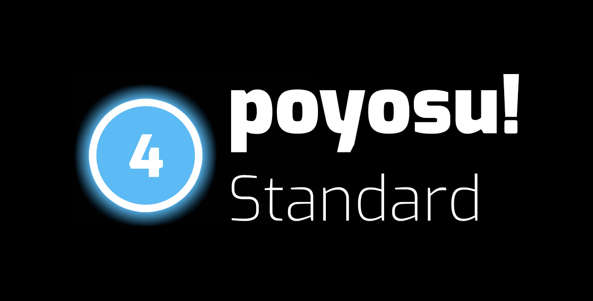
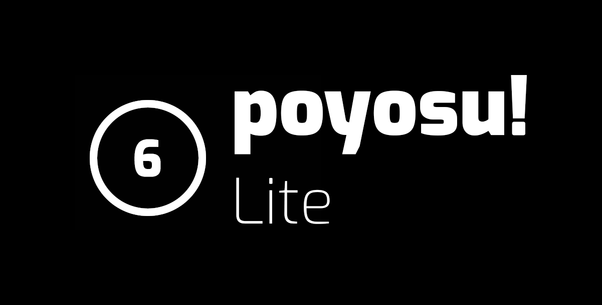

# poyosu!

I'm Poyo. This is my *osu!* skin. **If you want to download the skin, go to the [releases section of this repository](https://github.com/Poyo-SSB/poyosu/releases).** The standard version is colorful and flashy, while the lite version is much more minimal. Click the images for previews (from version 0.4.0)!

|[](https://streamable.com/ndmiz)|[](https://streamable.com/urs8q)|
|-|-|

If you would like a custom version of the skin with a custom flag and name above the health bar, feel free to contact me in *osu!* (Poyo_SSB) or through Discord (Poyo#4440).

If you want to know about the process of making the skin for some reason, read below.

## Why?

*osu!* is not an ugly game. Its default skin, in my opinion, isn't that bad. That's apparently an unpopular opinion, but the design is clean and consistent. In gameplay, it can be a little bit noisy, but I was perfectly content using it for my first few months playing *osu!*, even though I knew about the existence of skins from the very beginning.

I did actually try many, *many* skins during that time, but every single one was inferior to the default skin in one way or another. Whether it was an excess of anime girls, inconsistency in design, or overexaggerated elements, there was always something which annoyed me enough to make it usuable for practical purposes.

In late 2017, a few months after I really began playing, I discovered a skin called [Project VOEZ](https://osu.ppy.sh/community/forums/topics/471776) by a user named -yuo-. This skin, though completely impractical to play with, looked super cool and was the inspiration for me starting this project.

Over time, as I began to contribute to contribute to [osu!lazer](https://github.com/ppy/osu), I started to take inspiration from [flyte](https://twitter.com/_flyte), the mastermind behind [osu!lazer's design](http://osunext.tumblr.com). I'm not actually a designer, so the elements in this skin are completely disorganized and don't have a contiguous theme, but I tried my best to make it as consistent as possible. My goal with this skin was to balance the prettiness of Project VOEZ and the playability and readability of traditional skins, using lazer as a guideline.

## How?

I mentioned earlier that I'm not a designer. What I am is a software engineer. Like any engineer, I know my tools, and I know them well. Without them, I couldn't have done any of these. Here are the programs I used to generate the art in this skin:

* Blender
* Adobe Photoshop CC 2015
* Adobe Illustrator CC 2015
* Adobe ExtendScript Toolkit CC 2015
* Inkscape
* Visual Studio Code

As anyone who's created a skin by hand knows, creating all of the images used in skins is *very* painful. Scripting saved me an untold amount of time, and that's where my knowledge as a programmer came in handy. 

I'll go over each notable element in the skin in the order I created them.

### skin.ini

This is the starting point for any skin. This skin isn't actually brand new, I had a manually-created version of it prior to the creation of this repository, but I decided to start over, keeping only the elements which completely fit in the new one.

One of those elements is the combo color set. Since the very beginning, I've had *osu!* set to ignore beatmap skins, and this includes combo colors. For whatever reason, even the most experienced mappers have the strange habit of choosing extremely bright, unnatural colors.

I think this has something to do with the fact that most skins use monochromatic hit circles and slider tails, only indicating combo colour with a subtle glow or ring. As I intended to have solid hit circles, this would not do.

I ended up choosing six approximately equidistant colours on an RGB rainbow and manually adjusted each one to turn it into a more [pastel color](https://en.wikipedia.org/wiki/Pastel_\(color\)). These were the six colors which resulted:

![Six sequential colors. Loosely, a desaturated red, a gentle pink, an almost-purple periwinkle, a darker sky-blue, a grassy green, and yellow.][sequential-colors]

This is how it looks in-game, using the default skin:

![Six hit circles arranged horizontally, each using a color mentioned previously.][sequential-color-hit-circles]

### Sounds

The sounds are almost entirely taken from a skin called [Aesthetic](https://osu.ppy.sh/community/forums/topics/189843) by a user named Redon.

A few sounds (notably slider-related ones) have been made silent using this [44-byte silent wav file](http://up.ppy.sh/files/blank.wav).

The loop that plays during the pause screen is *[Chill](https://tobyfox.bandcamp.com/track/chill)* from the soundtrack of Undertale. 

### Cursor and trail

I don't actually recall what skin inspired the cursor in this skin, but it can really be boiled down to a white circle glowing pink.

The cursor trail is also pink and is really what makes the cursor difficult to lose. I really love it.

Upon loading the skin, one might notice that the cursor is very small and the trail looks strange.

![A picture of the pink cursor and its trail, which is subtly segmented.][strange-cursor]

This is done so that the cursor trail looks nicer. *osu!* has a setting which allows a user to resize the cursor anywhere from half to twice its regular size. However, the implementation of this feature also affects the scale of the cursor trail itself, not just its individual segments (`cursortrail.png`). This means that making the cursor and trail half its size and resizing it to twice its size in the options results in a normally-sized cursor, but with a cursor-trail with twice the fidelity of a typical one. That's why it's so lovely and smooth.

![A picture of the pink cursor and its trail, which appears to have no segmenting.][smooth-cursor]

Special thanks to [Aergwyn](https://osu.ppy.sh/users/3075211) for showing me this trick.

### Grades

#### Design

One of the most noticable things about this skin is its letter grades; they're brightly-colored, bold tokens rather than the sleek letters that normally appear in skins. This is where I really began to be inspired by osu!lazer. The font used for the letters is Exo, the same font used all over lazer.

Those who have actually tested lazer before might be rather confused at this point. The bright hexagon grades in my skin look completely different from the grades in lazer.

![The eight osu!lazer grade images pictured in a grid. In reading order, S, S+, SS, SS+, A, B, C, F.][lazer-grades]

These grades, in my opinion, looks rather silly. I can't really place why, but I don't like them. My lazer inspiration comes not from these, but—instead—old lazer grade icons. Very, very old grade icons. So old, in fact, that they predate development of lazer itself. This is from flyte's osu!lazer Tumblr, circa September 2014:

![A very old picture of the new osu! website, notably featuring pentagonal letter grades.][old-lazer-grades]

Note the pentagonal grades at the bottom. There do exist some images of other grades in this style, but they're very blurry and close to useless.

I will note that peppy recently leaked a preview of current plans for the future of the new *osu!* website, and that featured a tweaked version of current lazer grades:

![Concept art of the new lazer website, notably featuring nicer-looking letter grades.][new-lazer-grades]

If this version of the website is finished before the stable release of lazer, I'll definitely switch to using those over the tokens I have currently.

#### Development

I will admit something here: this project marks the first time I've actually used Adobe Illustrator, and I came at it from the strangest angle possible for a beginner—automation. It took a lot of poring over various obscure forums and unhelpful documentation, but I eventually managed to create a script that automated the process of creating the images to just this:

```javascript
process("#5fcd0b", "A", "A");
process("#026af3", "B", "B");
process("#bf17df", "C", "C");
process("#e20012", "D", "D");
process("#ff702e", "S", "S");
process("#bdbdbd", "S", "SH");
process("#ffbd0d", "SS", "X");
process("#bdbdbd", "SS", "XH");
```

The first parameter is the color of token, the second is the text, and the third is the file name.

I used a few utility functions to achieve this.

```javascript
function colorFromHex(hex) {
    var result = /^#?([a-f\d]{2})([a-f\d]{2})([a-f\d]{2})$/i.exec(hex);
    var color = new RGBColor();
    color.red = parseInt(result[1], 16);
    color.green = parseInt(result[2], 16);
    color.blue = parseInt(result[3], 16);
    return color;
}
```

This one parses a hexadecimal color into a Illustrator-compatible color.

```javascript
function exportFile(name, width, height) {
    var exportOptions = new ExportOptionsPNG24();
    exportOptions.matte = false;
    exportOptions.horizontalScale = (width / document.width) * 100;
    exportOptions.verticalScale = (height / document.height) * 100;
    
    var path = document.path + "/" + name + ".png"
    
    document.exportFile(new File(path), ExportType.PNG24, exportOptions);
}
```

This one allows me to export a file to a specified path given absolute pixel widths and heights. This one was incredibly useful, as *osu!* generally uses absolute sizes with its images rather than resizing them. This is done for the sake of efficiency, but also means that there are two files for each image—one normal, and one with the suffix `@2x` for HD screens. For letter grades, there are actually four images. One pair is used on the results screen and the other is used in score listings. This gets even worse with things like mode icons, where there are six images each for four modes.

The `exportFile()` function replaces all of that workload with four simple function calls placed in `process()`:

```javascript
const big = 900;
const small = 80;
exportFile("ranking-" + file + "@2x", big, big);
exportFile("ranking-" + file, big / 2, big / 2);
exportFile("ranking-" + file + "-small@2x", small, small);
exportFile("ranking-" + file + "-small", small / 2, small / 2);
```

I can simply open the document in Illustrator, open the script in ExtendScript Toolkit, press the run button, and the images are right there, skin-ready.

### Hit animations

#### Design

I think this is the coolest part of the skin. It's subtle, but I quite like how it turned out. This is the part that got me interested in skinning in the first place, and it's also the most direct reference to Project VOEZ in this skin.

Blender is typically used for 3D graphics, but it works just fine for 2D. The only disadvantage to using it for 2D is that rendertimes are much longer than they need to be due to the processing of the 3D environment (even though it isn't even used).

I could have probably done some funky trickery using Illustrator and lerping of values to get animations without long render times, but this was much more fun and I've been using Blender for about four years rather than one week, so I have much more experience with it.

The normal miss/50/100/300 hit animations are nothing special, just a simple white icon/text surrounded by a corresponding color glow. The combo finisher animations are much flashier, though, featuring a rainbow circle and white glowing ring. These are as simple as animating the scale and tweaking some curves, but the result was really nice.

#### Development

One problem with using Blender for 2D animation is that the processing effects it provides are are suited more for 3D animation rather than 2D animation. An effect like an outer glow, which is trivial to create in Illustrator or Photoshop, takes some work to achieve in Blender.

When all is said and done, the final node tree ended up looking like this:

![A complicated tree of nodes, each contributing a visual effect to a final image.][hit-animation-node-tree]

That looks *scary*.

...But it's much simpler than it may seem. Every node here handles either blur, glow, or alpha. Here are the six layers that go into a final image.

* A blurry white ring.
* A blurry rainbow ring (to simulate glow).
* A regular rainbow ring.
* A heavily blurred colored version of the text (large glow).
* A somewhat-blurred colored version of the text (stronger, smaller glow).
* A white, unblurred version of the text.

The script is nothing special; it looks a lot like the Illustrator JavaScript script from above, just in Python and much nicer. In short, it's a lot of hiding and unhiding, text changes, and color changes.

I do really mean it when I say it's nicer, though. It looks so, so much cleaner than any of the Illustrator scripts.	

### Mod icons

The mod icons used many of the same techniques that were described before. The icons were taken directly from lazer.

### Mode icons

*osu!* skins have three different sizes for each mode icon: `mode-x`, `mode-x-med`, and `mode-x-small`.

`mode-x` flashes in the center of the screen in the song-selection carousel to indicate which mode one is in.

`mode-x-med` appears in the mode-selection menu.

`mode-x-small` is overlaid upon the mode-selection button on the bottom.

I decided to use lazer's minimalistic icons rather than the boomy graphics that the stable client uses. Unfortunately, I couldn't actually find any official vector images of the icons, so I had to make my own. I mentioned earlier that this project was my first time really using Illustrator, but that's misleading, as I do have experience in vector software; I've been using Inkscape, an open-source alternative, for around five years. I traced the icons there and imported them into Illustrator for scripting purposes.

Initially, all three images were the icons that one might expect them to be, but in the end, only `mode-x-med` remained normal.

Taking another page out of Project VOEZ's book, I replaced all four `mode-x` images with a left-facing chevron, giving the beatmap carousel a nice background to lay on.

`mode-x-small` was a pain to work with. I discovered that the mode icons are actually not perfectly aligned to their button at all very quickly.

![An image of a red square with a white cross overlaid upon a button. The image is not aligned with the button.][mode-small-off-center]

It took a lot of trial and error before I found the correct offset; simply measuring it wasn't accurate enough, as *osu!* renders this particular texture at some arbitrary percentage of its actual size. The final mode image looks very strange in the skin folder, with empty space above it and to the right of it. However, it is noticably centered, so it was worth it.

### Selection icons

I decided to go with a more colorful look with the selection icons than the default skin has to contrast with my new black song-select panels, and I think it turned out quite well. One decision which was difficult to implement was the decision to remove the "Mode" text from the mode-selection icon in favor of just having the mode icon on its own. As mentioned earlier, it took a lot of trial and error to get the positioning right, but it looks perfect now.

### Score numbers

I actually quite like the default score numbers, but I don't like their black outlines. I just feel like it muddies things up. To get around this, I set up a Photoshop action which pastes each character onto a black background and uses the resulting image as an alpha channel on a pure white image. The result is essentially the same as the original except without the black background. I also did this on the `scoreentry` numbers, used for the input overlay and in-game score listings.

### Input overlay

This was probably one of the most annoying parts of the development of this skin. There are two parts to the input overlay that you see in-game: `inputoverlay-background` and `inputoverlay-key`. These are placed arbitrarily, which makes it very difficult to skin them in a pleasing manner if one needs alignment as I do. I ended up actually going through the game's code to find where the images are placed. I had to do some squashing and stretching to the files to make the images more closely squarelike.

[sequential-colors]: https://i.imgur.com/xniVlGC.png
[sequential-color-hit-circles]: https://i.imgur.com/WxaP7Zn.png
[simple-buttons]: https://i.imgur.com/LYOYso6.png
[strange-cursor]: https://i.imgur.com/QtWOXxu.png
[smooth-cursor]: https://i.imgur.com/K67G4aO.png
[lazer-grades]: https://i.imgur.com/vAzeUFv.png
[old-lazer-grades]: https://78.media.tumblr.com/b717e5ce8070fea0256a077d5ceff3f2/tumblr_nbozhzi8Da1tleiqgo1_1280.png
[new-lazer-grades]: https://puu.sh/zPLSK/a5448151fb.png
[hit-animation-node-tree]: https://i.imgur.com/9ecjVEU.png
[mode-small-off-center]: https://i.imgur.com/cXDIzeV.png
